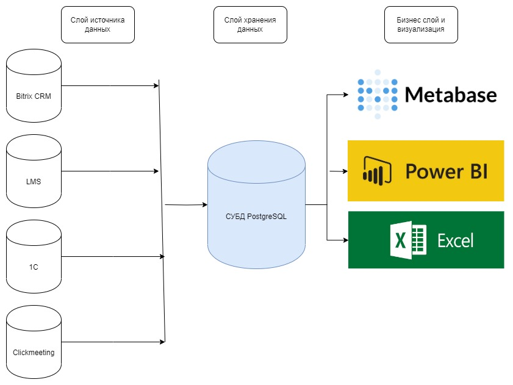

# Домашнее задание для модуля 1

**Необходимо выполнить следующие задания:**

- Создать новый репозиторий в GitHub для загрузки домашних заданий 
- Нарисовать диаграмму в Draw.io, в которой будут представлены бизнес-слой, слой источников данных и слой хранения данных
- Создать сводные таблицы и дашборд в Excel

**Итоги:**

1. Был создан [новый репозиторий](https://github.com/bengel-cooper/datalearn) в GitHub
2. Была создана [диаграмма](Diagram_1.jpg) в Draw io

3. Был создан [файл](Dashboard1.xlsx) со сводными таблицами и дашбордом. При использовании фильтра "Order date" при работе с дашбордом важно обратить внимание на то, что минимальный период времени, за который можно получить данные - 1 месяц.

